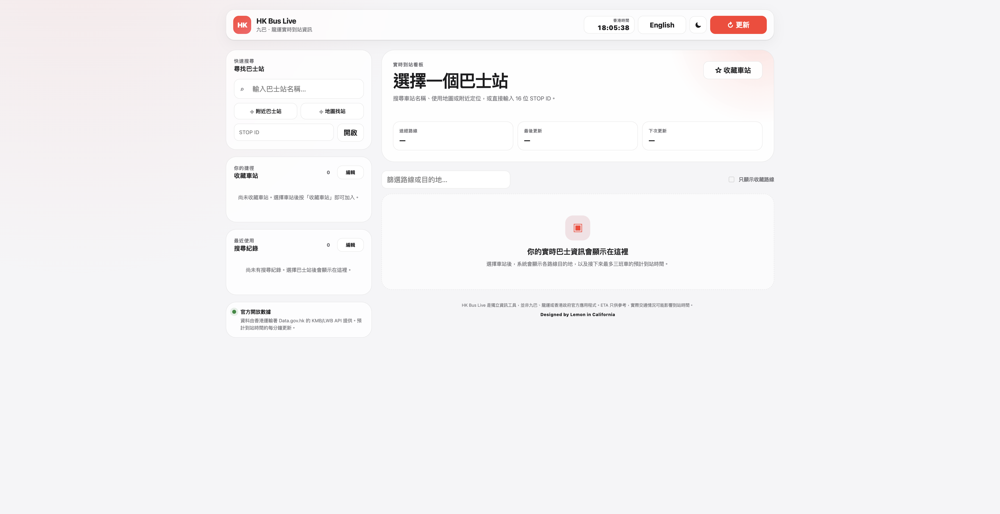
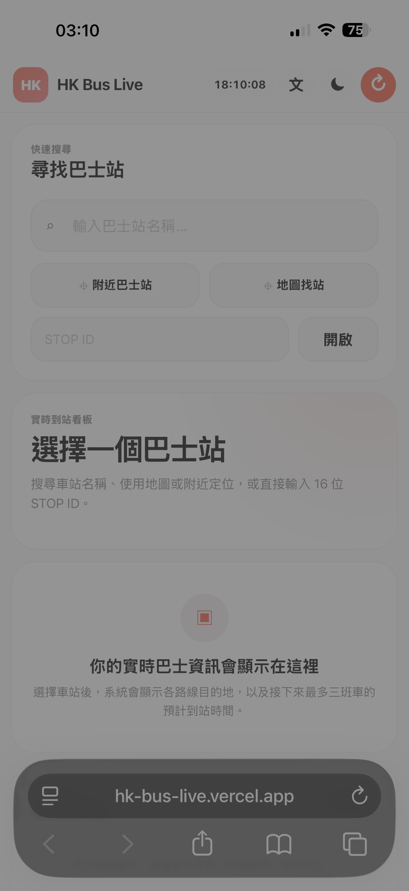

# HK Bus Live

A professional, responsive Hong Kong KMB/LWB real-time bus arrival web app.

## Live website

**HK Bus Live:** https://hk-bus-live.vercel.app/

**DEMO Video** https://youtube.com/shorts/K4OwAaJ_ojw?feature=share

## Screenshots

### Desktop / Laptop

<p align="center">
  
</p>

### Mobile

<p align="center">
  
</p>

## Features

- Real-time stop-wide ETA data with up to the next three arrivals per route
- Live Hong Kong clock plus countdown ETA and exact ETA clock time
- Bus stop name search using the official KMB/LWB stop directory
- Improved same-name-stop dropdown with coordinates, STOP ID, and pole code when available
- Interactive map picker: search on the map, tap the exact stop marker, then use that stop
- Nearby-stop discovery using browser geolocation
- Direct 16-character STOP ID lookup
- Saved stops and saved route preferences with localStorage
- Saved-stop Edit mode with individual removal, multi-select, Select all, and Remove selected
- Route/destination filtering
- Automatic 60-second refresh and manual refresh
- Traditional Chinese / English interface with matched component sizing so switching language does not shift the main layout
- Dynamic text fitting for long English stop names and route destinations while preserving fixed card sizes
- Light / dark mode
- Responsive desktop and mobile UI
- Search results expand in normal document flow instead of overlapping the saved-stop/data panels
- Mobile-safe header, ETA cards, saved-stop editor, map dialog, and safe-area spacing
- Footer credit: Designed by Lemon in California
- Static deployment with no build system required
- Starts with no bus stop selected; live ETA appears only after the user explicitly chooses a stop

## Bus-stop map and duplicate names

The **地圖找站 / Find on map** button replaces the previous demo-stop button. It uses the official KMB/LWB stop coordinates to place bus-stop markers on an OpenStreetMap base map.

This is useful when several physical stops have the same public name. The search dropdown now distinguishes those stops by location and official STOP ID. Where OpenStreetMap provides a `local_ref`, the app also displays the familiar pole code such as `KT646`. Pole-code lookup is optional and cached locally; if that lookup is unavailable, the official coordinates and STOP ID remain available.

## Data sources

Official KMB/LWB data:

- `https://data.etabus.gov.hk/v1/transport/kmb/stop`
- `https://data.etabus.gov.hk/v1/transport/kmb/stop-eta/{stop_id}`

Map / optional stop-reference support:

- OpenStreetMap map tiles
- OpenStreetMap Overpass API for optional bus-stop `local_ref` values
- Leaflet 1.9.4 for the interactive map

OpenStreetMap attribution is displayed directly on the map.

## Run locally

For the most reliable browser permissions and API behavior, serve the folder with a local web server:

```bash
python3 -m http.server 8000
```

Then open `http://localhost:8000`.

## Deploy

The current production deployment is available at **https://hk-bus-live.vercel.app/**.

Upload the folder to Vercel, Netlify, GitHub Pages, Cloudflare Pages, or another static host. Keep `index.html` at the project root.

## Notes

- ETA values are estimates and can change due to real traffic conditions.
- Nearby-stop and map location features require the user to grant browser location permission only when location is requested.
- The official stop directory is cached locally for 12 hours.
- Optional pole-code results are cached locally after they are found.
- The map requires an internet connection for OpenStreetMap tiles and Leaflet's CDN assets.
- The app intentionally does not restore the previously viewed stop when the page is reopened or refreshed.

## Saved-stop shortcut editing

The left-side **Saved stops / 收藏車站** panel has an Edit button. In Edit mode, tap a row or its checkbox to select it, use the individual remove button to delete one stop, or choose **Select all / 全選** and then **Remove selected / 移除已選** to clear all saved stops. Route favourites remain separate from the left-side stop shortcut list.

## Bilingual layout stability

The Chinese and English interfaces use matched button widths, fixed title/metadata regions, fixed search-result row heights, and constrained route-card text areas. This prevents the main navigation, stop header, saved-stop controls, and route cards from expanding or shrinking when the language changes.

## Search history

The left-side **Search history / 搜尋紀錄** panel records the most recent bus stops the user actually opens, with the newest stop shown first. Up to 20 recent stops are stored locally in the browser. Search history does not automatically select a stop when the page opens, so the live ETA board still starts empty.

Press **Edit / 編輯** to manage the history. A user can remove one entry with the individual ✕ button, select one or several entries with checkboxes, or choose **Select all / 全選** and then **Clear selected / 清除已選** to clear the full history. Tapping a history row outside Edit mode opens that stop again.
## Dynamic long-name fitting

Long stop names are measured against the actual space available in the current layout. Short names keep the normal large type size, while longer names are automatically reduced only as much as needed to remain on one line. The same fitting behavior is applied to the main stop title, route destinations, search-result names, saved stops, search history, and the selected stop in the map picker. The fixed-height card and panel layout is not changed, so Chinese and English modes remain aligned. The fitting is recalculated after language changes, content updates, and browser/device resizing.


## Apple-inspired mobile redesign

The mobile interface has been rebuilt around a cleaner, Apple-inspired visual system: SF-style system typography, neutral light/dark surfaces, restrained borders, soft translucency, larger touch targets, and consistent rounded geometry. On screens 720 px wide or smaller, the desktop two-column layout is flattened so **Find a bus stop** is followed immediately by the live arrival board and route results; Saved stops, Search history, and the data-source note move below the live content.

The mobile header is now a compact glass navigation bar with the HK Bus Live identity, Hong Kong clock, language switch, theme control, and refresh action on one line. Search controls fill the available width, Nearby and Map actions remain balanced in two columns, STOP ID entry uses a compact inline action, and all panels stretch to the full phone width. The route ETA blocks remain three-across on normal phones rather than becoming tall one-by-one rows.

When no stop is selected, the live-board statistics, favourite-stop action, and route-filter toolbar are progressively hidden, keeping the first screen focused on finding a stop. All changes preserve the same sizing logic in Traditional Chinese and English.


## Dropdown behavior

Search suggestions now open as a floating popover. The Nearby, Map, and STOP ID controls remain fixed in place while the dropdown opens and closes.
